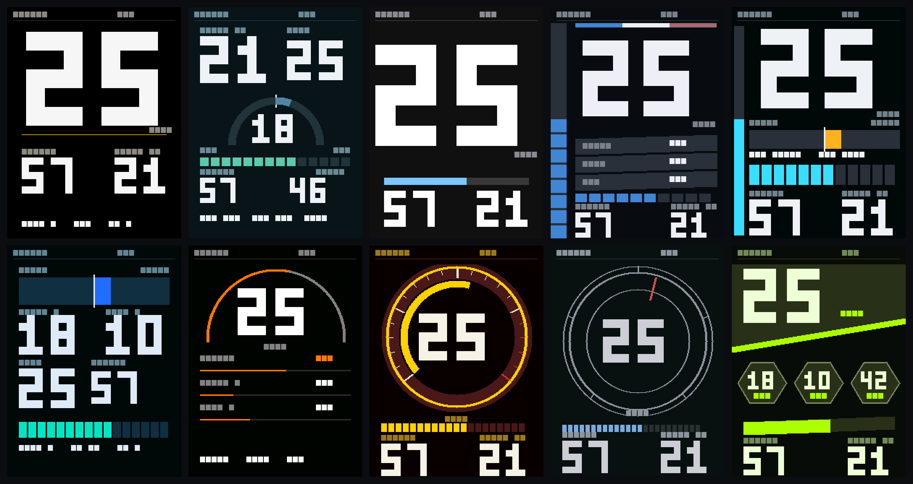

# vesc-workbench

A scripted workbench for **VESC** motor controllers: read, write and verify
configuration, drive LispBM, and diagnose problems — all over a phone's
Bluetooth bridge, with **no USB and no opening the enclosure**.

Built while getting a LaCroix Nazaré (FOCBOX Unity) onto firmware 7 and keeping
a discontinued DAVEGA X display working. That shim ships here as the worked
example, but the tooling is the point.

Maintained by Isaac Rowntree. MIT. Contributions welcome —
see [CONTRIBUTING.md](CONTRIBUTING.md).

---

## Is this what you're looking for?

You are in the right place if you have hit one of these:

- **"supported vesc firmware versions 5.x to 6.x - press any button to restart"** —
  a **DAVEGA X** stuck in a boot loop after a **VESC firmware 7** update. The
  [shim](docs/davega-shim.md) fixes it without downgrading. DAVEGA is
  discontinued, so no display-side update is coming.
- **You want to script VESC config but have no USB access** — the ESC is sealed
  in a deck or enclosure, and **VESC Tool's CLI is serial-only**. This drives it
  over the phone app's **Wireless Bridge to Computer (TCP)** instead:
  [how that works](docs/connecting.md).
- **You want VESC settings in version control** — read to XML, diff, apply,
  verify, repeat. Both motor sides of a dual ESC.
- **You are writing LispBM for a VESC** and want to run it in the real
  interpreter before uploading it to something with wheels on it.
- **Your throttle stopped working after a LispBM script ran** — `uart-start`
  permanently writes `app_to_use = APP_NONE`. `make upload-lisp` guards against
  it; [why](docs/findings.md#uart-start-permanently-flashes-app_to_use--app_none).
- **You want to know what the remote is actually sending** — `make ppm-watch`
  tells "the remote is not transmitting" apart from "the decoder is not
  running", which look identical in the GUI.

Tested on a **FOCBOX Unity** (dual motor, internal CAN) on a **LaCroix Nazaré**,
firmware **7.00**. The tooling is hardware-agnostic; the profile is the only
board-specific part.

## What it gives you

### Scripted config over BLE — no USB

VESC Tool's CLI is serial-only: `--vescPort` calls `connectSerial()`, and it
rejects an IP and never completes the handshake over a `socat` PTY. But
`--loadQml` runs arbitrary QML **inside the application**, with the `VescIf`
singleton in scope — and `VescIf.connectTcp()` is invokable. Point that at the
phone app's TCP bridge and the whole configuration API is scriptable:

```
your laptop  --TCP-->  phone (VESC Tool app)  --BLE-->  ESC
```

```sh
make pull      # read both motor sides' configs to XML
make apply     # write them back, then verify by reading them again
```

**[docs/connecting.md](docs/connecting.md) is the how** — a copy-pasteable
`connect.qml` that works without the rest of this repo, the `VescIf` API surface
worth knowing, and the connection failure modes.

> [!IMPORTANT]
> `setMcconf(true)` is required — with `check=false` the ESC silently ignores the
> write. And **wait for the firmware string** before reading anything:
> `isPortConnected()` goes true seconds before the ESC has sent its parameters,
> and reads in that window return defaults that look exactly like a wiped
> controller. Same after any reboot.

### A LispBM development workflow

```sh
make upload-lisp LISP=path/to/script.lisp   # upload and run
make lisp-stats                             # heap, CPU, globals
make lisp-stop / lisp-erase                 # stop or remove
make test-lisp                              # run it in the real interpreter
```

There is an integration harness too: `tests/lisp/test_reader.lisp` drives the
real UART reader through a fake serial line that can split a frame header
across reads, so framing and resync are tested rather than assumed.

Scripts are tested by running them in the **upstream LispBM REPL** (Docker),
not by transcribing them into another language. `tools/minify-lisp.py` strips
them before upload, because upload happens in 384-byte chunks with a 1-second
per-chunk timeout and size genuinely matters.

Globals double as a telemetry channel: `lispGetStats` returns them, so a script
can report internal counters without needing print output to work.

### Diagnostics

```sh
make davega-debug SECS=60   # health check with a verdict
make faults                 # stored fault history + live values, both sides
make ppm-watch              # live remote readout, prints only on change
make ppm-cal                # guided calibration: neutral / full throttle / full brake
```

`ppm-watch` distinguishes "the remote is not transmitting" from "the decoder is
not running" — both look identical in a GUI.

### Safety affordances

```sh
make motors-off / motors-on   # app-disable-output, no config write
make reboot                   # stop LispBM and restart the app layer
make lisp-erase               # back to stock behaviour
make check                    # bridge up? desktop VESC Tool closed?
```

`motors-off` lets you work on a live board with the display running and the
motors inert, without touching configuration.

## The DAVEGA shim (worked example)

A DAVEGA X on VESC 7 refuses to start:

> supported vesc firmware versions 5.x to 6.x - press any button to restart

The telemetry protocol **did not change** — `tests/protocol-diff.sh` proves it
against upstream on every CI run:

| Surface | 6.00 | 7.x | Same? |
|---|---|---|---|
| `COMM_GET_VALUES` payload | 25 fields | 25 fields | ✅ byte-identical |
| `COMM_FW_VERSION` structure | — | — | ✅ identical |
| `FW_VERSION_MAJOR`/`MINOR` | 6/00 | 7/01 | ❌ the only difference |

So the display is not failing to parse anything. It is refusing to talk, on two
bytes. The shim proxies every command to the firmware's own decoder via
`cmds-proc` and rewrites only those two, recomputing the CRC — 27 lines of Lisp
for the rewrite itself, 178 for the whole shim including the UART reader and
its debug counters.

See [docs/davega-shim.md](docs/davega-shim.md). For the display itself — its
hardware, its `/config.json` settings, and what is still downloadable from the
vendor — see [docs/davega-x.md](docs/davega-x.md).

## Ten dashboards for the DAVEGA X

The shim keeps the stock display working. If you would rather replace it, the
DAVEGA X is an ESP32 running MicroPython that runs a user `start.py` *before*
its own app — so a new dashboard is one file, and holding UP at boot puts the
stock one back.



Ten themes, each with **its own layout** rather than its own palette: an
analogue tachometer, hexagonal shards, hairline arcs, one enormous numeral,
concentric rings, a shift-light rail, a power-flow meter. Pick one from the
display's own menu, or:

```sh
make davega-install              # push the dashboard, as precompiled bytecode
make davega-theme THEME=nazare   # choose a layout
make davega-display MODE=day     # or night
```

Those pictures are not mockups. They are the real screen code run through a
host-side stand-in for the panel, saved as the pixels it produced — which is
also how the tests work:

```sh
make gui-test      # 390 checks, no hardware
make mockups       # every screen x every theme x day/night, to HTML
```

The panel has `fill_rectangle`, `pixel` and `writeblock` and no line, circle or
polygon, and on the device a draw call costs **2.9 ms whatever its size**. So an
arc drawn a rectangle per column costs 481 ms — four times the budget for a
whole frame — and the curves are instead composed into a buffer and pushed in
one transfer at 12 ms a band. See [davega-gui/README.md](davega-gui/README.md)
for the design, and [docs/theme-layouts.md](docs/theme-layouts.md) for what the
hardware will and will not do.

## Requirements

- VESC firmware **6.06+** for `cmds-proc` (developed on 7.00)
- **VESC Tool desktop** — never opened as a GUI, it is just the Qt runtime the
  scripts need. macOS and Linux paths are both detected; override with `VESC=`
- **VESC Tool on a phone**, connected to the ESC over Bluetooth
- Docker, for the Lisp tests
- Both devices on the same network, without client isolation (most guest Wi-Fi
  has it — use a phone hotspot instead)

## Getting connected

Full walkthrough, including a standalone `connect.qml` you can use without this
repo: **[docs/connecting.md](docs/connecting.md)**.

**1. On the phone** — connect to the ESC over BLE as normal, then Start page →
**Wireless Bridge to Computer (TCP)** → **Activate Bridge**. Note the phone's IP;
the bridge listens on port **65102** and accepts **one client at a time**, so
close desktop VESC Tool.

**2. On the laptop** — put the address in `profiles/local.mk` (gitignored):

```make
HOST  ?= 192.168.1.100   # phone running the bridge
PORT  ?= 65102
CANID ?= 124             # second motor thread, if you have one
```

**3. Check before you do anything else:**

```sh
make check     # bridge reachable? desktop VESC Tool closed?
make probe     # connect, report firmware and LispBM stats
make help      # everything else
```

`make check` tells the two failure modes apart in a second, instead of leaving
you to interpret a two-minute timeout.

Every target takes `PROFILE=`:

```sh
make pull PROFILE=profiles/local.mk
make davega-debug PROFILE=profiles/nazare-unity.mk
```

## Board profiles

`profiles/` holds one file per known-good setup — connection details and the
second motor's CAN id. Deliberately **not** motor tuning: current limits and
gearing are specific to your hardware and copying someone else's is how motors
and packs get damaged. Run the detection wizard.

## Status

| | |
|---|---|
| Config read/write/verify over BLE | ✅ |
| LispBM upload, test, diagnose | ✅ |
| DAVEGA version gate bypass | ✅ telemetry live on a Unity, FW 7.00 |
| `COMM_FORWARD_CAN` to a second motor | ✅ verified on hardware — [findings](docs/findings.md#comm_forward_can-to-a-second-motor-works) |
| Traction control | ✅ confirmed in motion, `tc_max_diff` 6000 on grass |
| Hardware tested | FOCBOX Unity only |
| DAVEGA X WebREPL scripts | ⚠️ written from the firmware images, never run on a device — [docs](docs/davega-x.md) |

## Safety

This writes motor controller configuration and can enable or disable motor
output. Wheels off the ground for anything involving detection, app config or
`app-disable-output`. Verify the throttle before riding.

## Troubleshooting

Connection problems — bridge unreachable, reads coming back as defaults —
are in **[docs/connecting.md](docs/connecting.md#connection-troubleshooting)**.

Board behaviour:

| Symptom | Cause | Fix |
|---|---|---|
| Throttle dead after running Lisp that calls `uart-start` | `app_to_use` flashed to `APP_NONE` | `make apply-appconf` — and `make upload-lisp` now prevents it |
| PPM settings will not stick | `ctrl_type = 0` rejects the sub-config | `make apply-appconf` primes it automatically |
| A write "succeeds" but nothing changes | `setMcconf(false)` | Always `setMcconf(true)` |
| `did you forget to upload the code` | `lispWriteCode` does not land code | `make upload-lisp` (uses `CodeLoader.lispUploadFromPath`) |
| A Lisp context dies silently | `(var t ...)` shadows LispBM's `t`, which never resolves from the environment | Rename the variable |

The reasoning behind each, and the firmware source it comes from:
[docs/findings.md](docs/findings.md). Still-open problems:
[docs/known-issues.md](docs/known-issues.md).

## Credits

VESC and LispBM by Benjamin Vedder. DAVEGA by Jan Pomikalek. This project is not
affiliated with either.
